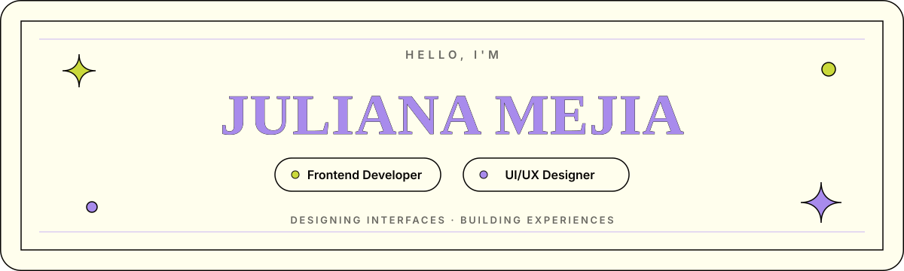

  

 

  

## About me

I'm a **Multimedia Engineer** and **UI/UX Designer** focused on frontend development. I turn ideas and prototypes into responsive, accessible and visually thoughtful digital products, connecting design decisions with clean implementation.

- Based in **Colombia**.
- Building interfaces with **React, TypeScript and JavaScript**.
- Designing user flows, components, prototypes and design systems in **Figma**.
- Experienced in translating complex requirements into clear and intuitive experiences.
- Interested in scalable UI architecture, accessibility and meaningful interaction details.

## What I bring

<table>
  <tr>
    <td width="33%" valign="top">
      <h3>Frontend development</h3>
      
Responsive interfaces, reusable components and maintainable application flows.

    </td>
    <td width="33%" valign="top">
      <h3>UI/UX design</h3>
      
Wireframes, prototypes and visual systems centered on clarity and usability.

    </td>
    <td width="33%" valign="top">
      <h3>Product thinking</h3>
      
Design and development decisions connected to real users and project goals.

    </td>
  </tr>
</table>

## Tech stack

  

## Featured work

<table>
  <tr>
    <td width="33%" valign="top">
      <h3>SECUB</h3>
      
Frontend work for an academic assurance platform, including role-based experiences, complex workflows, tables, filters and a consistent interface system.

      
<code>React</code> <code>TypeScript</code> <code>UI/UX</code>

    </td>
    <td width="33%" valign="top">
      <h3>RaizAR</h3>
      
Research-driven graduation PWA shaped through surveys and usability testing, with a strong focus on user experience and interface design.

      
<code>PWA</code> <code>UX Research</code> <code>UI Design</code>

    </td>
    <td width="33%" valign="top">
      <h3>HW Atelier</h3>
      
Responsive institutional website with reusable components, structured content and an editorial visual direction for a textile creation house.

      
<code>React</code> <code>Vite</code> <code>CSS Modules</code>

    </td>
  </tr>
</table>

  

## GitHub activity

  
  

 

  Designing thoughtful interfaces and turning them into digital experiences.

